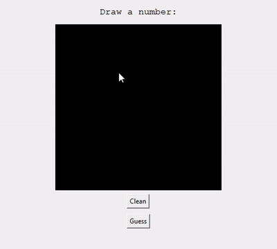

## Number Guessing Game :video_game:

### Overview

This project is an interactive number guessing game developed in Python with the Tkinter framework. It allows players to draw numbers on the screen, and a pre-trained neural network model, utilizing the MNIST dataset, provides real-time recognition.



### Installation

To run the game locally, follow these steps:

1. Clone this repository to your local machine.
   ```shell
   git clone https://github.com/HannaAst/NumberGuesser.git
   ```
2. Install the required Python libraries. 
    ```shell 
    pip install -r requirements.txt
    ```
3. Run the game.
    ```shell 
    python NumberGuesser.py
    ```

### Usage

1. Launch the game using the provided installation instructions.
2. Draw a number on the screen.
3. The neural network model will recognize the number and display it.

### Acknowledgments

The neural network model is trained on the [MNIST dataset](https://www.tensorflow.org/datasets/catalog/mnist).